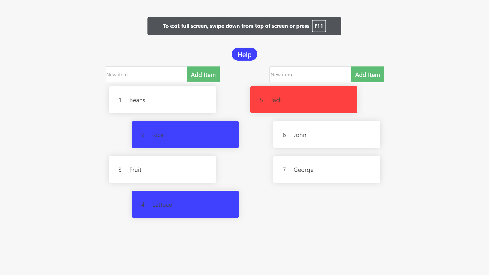

## Website demonstrating a many-to-many relationship in a database
It simply displays two simple SQL tables as well as the many-to-many relationship between them in a novel way.

### Set up
* Serve the files in the `frontend/dist` directory
* Start the backend with `mvn spring-boot:run`
* Proxy requests going to `/rdb-api` on port 80 to `localhost:8080/rdb-api`

### Screenshots
